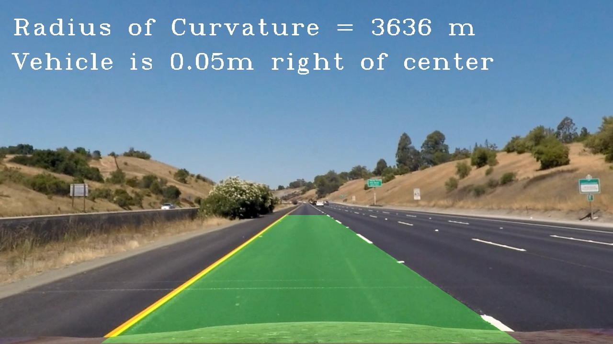

## Advanced Lane Finding
[](http://www.udacity.com/drive)



[//]: # (Image References)

[image1]: ./readme_images/undistorted_image.png "Undistorted"

[image3]: ./readme_images/test_undistorted.png "Test Undist"
[image4]: ./readme_images/binary_output.jpg "Binary Output"
[image5]: ./readme_images/warped_image.png "Warped Image"
[image6]: ./readme_images/fitting.png "Fit Visual"
[image7]: ./readme_images/final_result.jpg "Final Output"

Overview
---

The goal of this project is to write a software pipeline to identify the lane boundaries in a video, as well as calculating the radius of curvature and the offset of the vehicle from the center of the road in each frame.

---

The steps of this project are the following:

* Compute the camera calibration matrix and distortion coefficients given a set of chessboard images.
* Apply a distortion correction to raw images.
* Use color transforms, gradients, etc., to create a thresholded binary image.
* Apply a perspective transform to rectify binary image ("birds-eye view").
* Detect lane pixels and fit to find the lane boundary.
* Determine the curvature of the lane and vehicle position with respect to center.
* Warp the detected lane boundaries back onto the original image.
* Output visual display of the lane boundaries and numerical estimation of lane curvature and vehicle position.

Camera Calibration
---
We need to perform camera calibration to obtain the camera matrix and distorsion coefficients that we will then use for Distortion Correction.

* A list of calibration images stored in `./camera_cal/` is used.
* For each image, we search for chessboard corners and store them in objpoints and imgpoints if they are found.
* Having these object and image points we can then use them in `cv2.calibrateCamera()` function.

I applied this distortion correction to the test image using the `cv2.undistort()` function and obtained this result:

![alt text][image1]

Distortion correction
---
We can also take a look at the distortion correction applied to one of the test images like this one:
![alt text][image3]

Color & Gradient Threshold
---
In order to define a binary thresholded image, different thresholds are used:
* Absolute value of Sobel operator in x and y direction
* Magnitude of the gradient
* Direction of the gradient

For the color thresholds I have used:
* S (Saturation) and H (Hue) thresholds from HLS color space (for better detection of yellow lines)
* L (Lightness) threshold from HLS color space (for better detection of white lines)

Other color thresholds could be used as well as other combinations of threholds in order to obtain a final binary image.

Here's an example of my output for this step:

![alt text][image4]

Perspective Transform
---

To obtain a perspective transfrom of an image ("bird-eye" view), four source points are selected in the original image and four destination points where these source points will appear in the warped image are also selected.

Then, we can make use of the`cv2.getPerspectiveTransform` to obtain the perspective transform M as well as the inverse perspective transfrom Minv.

Here is an example:

![alt text][image5]

Detection of lane pixels & fitting
---

Having a thresholded binary image, we need to decide which pixels of the image belong to the lines as well as fitting a polynomial that represents the right and left lines.

For the detection of lane pixels I used two functions:
* `find_lane_pixels()` finds lane pixels from scratch making use of the Sliding Windows algorithm.
* `search_around_poly()` searchs for line pixels if we have a confident prior polynomial estimate.

For fitting a polynomial to each lane, I used `poly_coeff()` and `fit_poly()` to obtain polynomial coefficients and x and y values respectively.

The output looks like this:

![alt text][image6]

Curvature & Offset calculation
---
In order to measure the radius of curvature of each line as well as the offset of the car center from the center of the road, I used the `measure_curvature_offset()` function in the `Curvature & Offset calculation` cell of the jupyter notebook.

Concretely, I calculated the Radius of Curvature for each line and take the average.

For the offset calculation, I defined it as the difference between the image center and the lane center.

All the calculations are given in meters, making use of the following conversions:
```python
#Conversions in x and y from pixel space to meters
ym_per_pix = 30/720 # meters per pixel in y dimension
xm_per_pix = 3.7/700 # meters per pixel in x dimension
```
We have assumed that the lane is about 30 meters long and 3.7 meters wide.

Final output
---
Here is an example of the final output on a test image:

![alt text][image7]

Video processing
---
The pipeline is implemented for processing videos in the following way:
* Every frame is processed through each of the steps described above.
* The estimated lanes in each frame need to pass some sanity checks in order to be considered as a good measurement.
* A weighted average over the last 10 high-confident measurements is used.
* If the lines are not detected within 3 frames in a row, the Sliding Window algorithm is used. Else, we search around a region over last good estimates.

Here's a [link to my project video result](./output_videos/project_video_output.mp4) and a [link to my challenge video result](./output_videos/challenge_video_output.mp4).
